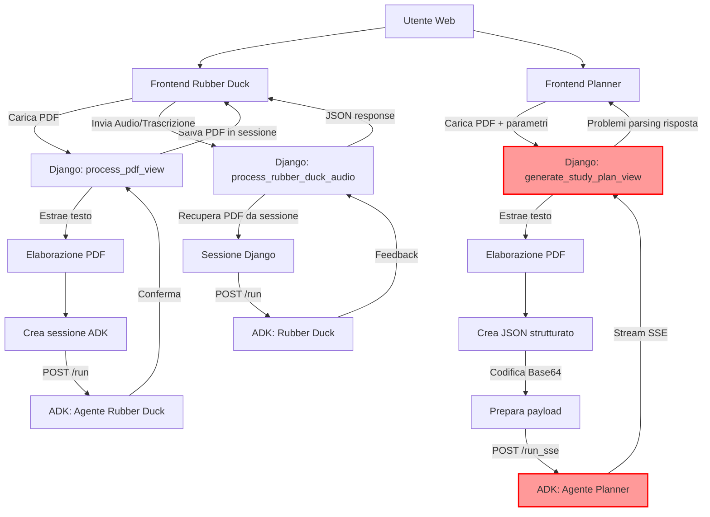

# Report Tecnico Hackathon: Sistema Multi-Agente "Braynr"

## 1. Introduzione

Questo report descrive l'architettura tecnica e l'implementazione del progetto "Braynr", un sistema di supporto allo studio potenziato da intelligenza artificiale. Il sistema si basa su un'architettura multi-agente, con due agenti principali: "Rubber Duck" per l'apprendimento attivo e "Planner" per la creazione di piani di studio personalizzati. L'obiettivo è fornire agli utenti strumenti innovativi per migliorare l'efficacia del loro studio.

## 2. Architettura Generale

Il sistema è composto dalle seguenti parti principali:

*   **Backend:** Sviluppato in Python utilizzando il framework Django. Gestisce le richieste HTTP, l'interazione con gli agenti AI e la logica di business.
*   **Servizio Agenti (ADK - Agent Development Kit):** Una piattaforma esterna (presumibilmente) che ospita gli agenti AI. L'interazione con l'ADK avviene tramite chiamate API HTTP.
*   **Frontend:** Interfacce web basilari (HTML servite da Django) per permettere all'utente di interagire con le funzionalità.

## 3. Implementazione degli Agenti

### 3.1. Agente "Rubber Duck"

*   **Scopo:** Facilitare la comprensione profonda del materiale di studio attraverso la tecnica del "rubber ducking", dove l'utente spiega i concetti come se li stesse insegnando.
*   **Flusso di Interazione:**
    1.  **Caricamento PDF:** L'utente carica un documento PDF tramite l'interfaccia web. Django riceve il file, ne estrae il contenuto testuale utilizzando la libreria `PyPDF2` e pulisce il testo da caratteri problematici.
    2.  **Invio Contesto all'ADK:** Il testo estratto viene inviato all'agente Rubber Duck sull'ADK. Questa operazione è gestita dalla funzione `_call_adk_run_for_rubber_duck` in `views.py`, che effettua una richiesta POST all'endpoint `/run` dell'ADK. Viene utilizzata una sessione ADK dedicata e persistente (`ADK_RUBBER_DUCK_SESSION_ID`) per questo agente, la cui esistenza è assicurata dalla funzione `_ensure_rubber_duck_adk_session`.
    3.  **Spiegazione dell'Utente:** L'utente fornisce la sua spiegazione del materiale (attualmente tramite trascrizione testuale inviata dal frontend).
    4.  **Valutazione e Feedback:** La spiegazione dell'utente viene inviata allo stesso agente Rubber Duck sull'ADK per ottenere un feedback sulla comprensione. Il contesto del PDF, precedentemente assimilato, dovrebbe essere utilizzato dall'agente per formulare la sua risposta. Il testo del PDF viene salvato nella sessione Django (`request.session['pdf_context_text']`) per eventuali riferimenti futuri senza dover riprocessare il file.
*   **Tecnologie Chiave:** Django (gestione richieste, sessioni), `requests` (chiamate HTTP), `PyPDF2` (parsing PDF), JSON.

### 3.2. Agente "Planner"

*   **Scopo:** Generare piani di studio personalizzati basati sul contenuto di un documento PDF, la durata desiderata per lo studio e le preferenze dell'utente.
*   **Flusso di Interazione:**
    1.  **Input Utente:** L'utente fornisce un file PDF, specifica la durata dello studio in giorni e indica eventuali preferenze tramite l'interfaccia web.
    2.  **Estrazione Contenuto:** Similmente all'agente Rubber Duck, il testo viene estratto dal PDF e pulito.
    3.  **Chiamata all'ADK Planner:** I dati raccolti (testo del PDF, durata, preferenze) vengono strutturati in un payload JSON. Questo JSON viene codificato in Base64 e inviato all'agente Planner sull'ADK tramite la funzione `_call_adk_run_specific_agent`. Questa funzione effettua una richiesta POST all'endpoint `/run_sse` dell'ADK, che suggerisce un meccanismo di Server-Sent Events per risposte potenzialmente lunghe o in streaming. Per l'agente Planner, viene generato un ID di sessione ADK univoco (`planner_session_` + UUID) per ogni richiesta.
*   **Tecnologie Chiave:** Django, `requests`, `PyPDF2`, `json`, `base64`, `uuid`.
*   **Stato Attuale e Criticità:**
    *   L'agente Planner, quando interrogato direttamente tramite richieste manuali (es. da console o strumenti come Postman) all'infrastruttura ADK, dimostra di funzionare correttamente e di essere in grado di generare piani di studio validi.
    *   **Tuttavia, l'integrazione con l'applicazione Django presenta delle problematiche.** In particolare, la vista `generate_study_plan_view` in `views.py` non riesce a ottenere e/o processare correttamente la risposta dall'agente Planner. Le cause sembrano risiedere in difficoltà con le richieste POST inviate da Django (possibili problemi di formattazione del payload o gestione degli header per l'endpoint SSE) o in bug nella deserializzazione/gestione della risposta streamata proveniente dall'ADK. Il codice attuale contiene sezioni di debug che indicano che la risposta completa e strutturata (la roadmap) non viene ricevuta come atteso dall'interfaccia web.

## 4. Stack Tecnologico Riepilogativo

*   **Linguaggio Backend:** Python 3.x
*   **Framework Web:** Django
*   **Interazione API:** Libreria `requests` per chiamate HTTP sincrone e streaming (SSE).
*   **Elaborazione Documenti:** `PyPDF2` per l'estrazione di testo da file PDF.
*   **Formati Dati:** JSON per la strutturazione dei dati e Base64 per la codifica del payload per specifici endpoint ADK.
*   **Piattaforma Agenti AI:** ADK (Agent Development Kit) - utilizzata come servizio esterno.

## 5. Conclusioni e Sviluppi Futuri

Il sistema "Braynr" implementa con successo un'architettura multi-agente per il supporto allo studio. L'agente Rubber Duck è integrato e funzionante. L'agente Planner, sebbene concettualmente valido e funzionante in isolamento, richiede ulteriore debugging per risolvere i problemi di comunicazione tra l'applicazione Django e il servizio ADK, specificamente per quanto riguarda le richieste POST all'endpoint SSE e la gestione della risposta.

---

## Punti Chiave per la Presentazione Tecnica (5 minuti)

1.  **Progetto Braynr:** Sistema di supporto allo studio con AI, basato su Django e un ADK (Agent Development Kit) esterno.
2.  **Due Agenti Principali:**
    *   **Rubber Duck:**
        *   Funzione: Aiuta a capire meglio il materiale spiegandolo.
        *   Come: Carica PDF -> Django estrae testo -> Invia testo all'ADK (sessione fissa, endpoint `/run`). Utente spiega -> Django invia spiegazione all'ADK -> ADK dà feedback.
        *   Tecnologia: Django, PyPDF2, `requests`. Funzionante.
    *   **Planner:**
        *   Funzione: Crea piani di studio da PDF, durata e preferenze.
        *   Come: Carica PDF + input -> Django estrae testo e prepara dati -> Invia dati JSON (codificati Base64) all'ADK (sessione dinamica, endpoint `/run_sse`).
        *   Tecnologia: Django, PyPDF2, `requests`, `base64`, `json`.
3.  **Stato del Planner:**
    *   **Funziona bene da console:** Se chiamo l'ADK direttamente con i dati giusti, il piano viene generato.
    *   **Problemi da Django:** L'integrazione web non va. Difficoltà con le richieste POST da Django all'endpoint `/run_sse` dell'ADK o nel ricevere/interpretare la risposta. Stiamo lavorando per fixare questo bug.
4.  **Stack Tecnologico:** Python, Django, `requests` per API, `PyPDF2` per PDF, ADK per gli agenti.
5.  **Obiettivo:** Fornire strumenti AI per uno studio più efficace. Rubber Duck OK, Planner in via di risoluzione per l'integrazione web.

# flow graph:

